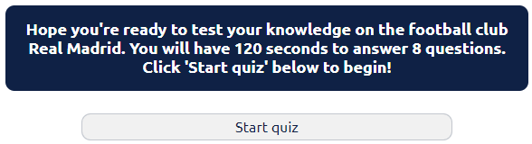
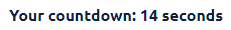
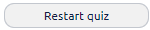

# Real Madrid Quiz
This website is for people who are a fan of the football club Real Madrid or are just a fan of football in general and wish to test their knowledge. 

This quiz is meant for fun, for people of all ages and is likely to attract anybody who loves football or just loves doing quizzes. It can also be used as a new way of promoting the football club. 

## Features

### Heading and image

At the top of the page is the title and also Real Madrid's club crest. The title should make it clear to the user what kind of webpage they are on. The football club badge is also immediately recognisable to a lot of people.

The colour used for the banner at the top of page has been taken directly from the official Real Madrid website to allow for immediate brand recognition. These colours are then used throughtout the website.

### Opening statement and star quiz

Below the club crest there is an opening statement gives the user an idea of what to expect from the upcoming quiz.

There is a start quiz button below which the user can click to begin the quiz. Once the button has been clicked the first quetion and answers will appear alongisde the score and the countdown timer which will begin counting down.

### Countdown timer

A countdown has been added in the centre of the screen with the text in bold to draw the user's eye to it. The timer counts down from 120 seconds to give the quiz a sense of urgency and excitement for the user. This allows the user 15 seconds per question.

### Score

The score increases by one every time a correct answer is selected by the user. It shows the score out of eight, letting the user know there are eight questions, which is crucial given the countdown.

### Question and answers

There are eight questions overall and four multiple choice answers for each. The order of the answers changes each time the quiz is started to enhance replayability. The questions are numbered from 1 to 8 so the user knows how far through the quiz they are. 

The user can hover over each answer and the background colour will change to a yellow taken straight from the club crest. This is to allow for continued consistency in the club's branding. The question box has the colours inverted compared to the answer buttons so as to distinguish it from the rest and so the user doesn't confuse it with another button. 

### Clicking a correct answer

If the user clicks on a correct answer a pop up will appear with some text letting the user know "You've got the correct answer". There is also an image included which relates directly to the answer chosen. In the example of the first question the correct answer is Cristiano Ronaldo and the image that pops up is of him in a Real Madrid shirt. The pop up message is timed so it will disappear after a short while to allow the user to continue on with the next question. There is also an "OK" button so the user can carry on quicker if they wish as the countdown does continue.

### Clicking an incorrect answer

If the user clicks on an incorrect answer a pop up will appear with some text letting the user know "That's wrong unfortunately". The pop up will also show the correct answer so the user can learn more about the football club as they progress through the quiz.

### Restart button

A restart button has been added so the user can attempt the quiz again if they wish without having to refresh the page. The button will take the user back to opening screen where they can click the 'Start quiz' button to begin. It has the same colour scheme as the other buttons so it is immediately recognisable as a button. However the width is smaller and the colours are different when the mouse hovers over so as to distinguish it from the answer buttons.

### End of quiz message

After the user answers the last question or once the countdown reaches zero, a pop up will appear with a message to let the user know what score they have achieved. Once the pop up has been closed the user will be taken back to the opening screen. There are three potential messages depending on the score they achieve. One message for a maximum score of eight, one for a score of less than five and one more for in between those scores. There is also a message for if the countdown reaches zero before answering all the questions. Finally there is a link to allow the user to share their score on social media so as to increase the awareness of the quiz.

## Testing

### Html

No errors were found when the HTML code was ran through the [W3C validator](https://validator.w3.org/#validate_by_input)

### CSS

No errors were found when the CSS code was ran through the [Jigsaw Validator](https://jigsaw.w3.org/css-validator/#validate_by_input)

### JavaScript

No errors were found when the JS code was ran through the [Jshint validator](https://jshint.com/)

## Deployment

The site was deployed to GitHub pages. The steps to deploy are as follows:
 - In the GitHub repository, go to the Settings tab 
 - From code and automation, go to pages
 - Deploy from the main branch and refresh the page until the link to the website appears 

The live link is as follows - https://tomh131.github.io/real-madrid-quiz/

## Accessibilty

Running the website through the lighthouse proves there are no issues.

## Credits 

### Content

 - The pop up alerts were taken from [SweetAlert](https://sweetalert2.github.io/)
 - The font was taken from [Google font](https://fonts.google.com/)
 - The answer shuffle function was taken from [Lodash](https://lodash.com/docs/4.17.15#shuffle)
 - Website icon taken from [Favicon](https://favicon.io/)

### Media

Images were taken from various websites after searching in Google images.